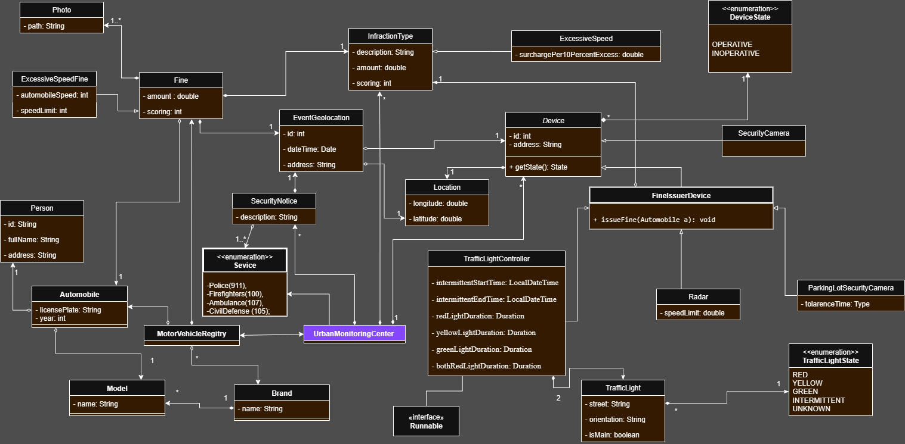

# 🏙️ Urban Monitoring Center – System Architecture

## 1. Introduction
This document outlines the high-level architecture of the Urban Monitoring Center simulation. It describes the system’s key components, their responsibilities, and how they interact — without delving into class-level details, which are covered in the separate data dictionary.

---

## 2. System Overview

The system is designed to monitor and enforce traffic regulations, coordinate emergency responses, and manage data from a distributed network of urban devices.

Key capabilities include:
- Monitoring intersections, devices, and vehicles
- Issuing fines for detected violations
- Dispatching emergency services when required
- Simulating real-time urban dynamics (e.g., traffic cycles, security events)

---

## 3. Components & Responsibilities

### 🚦 UrbanMonitoringCenter (Singleton)
- Acts as the central hub
- Manages devices, service definitions, and security notices
- Interfaces with the vehicle registry for fine linkage

### 📡 Devices
- Physical or simulated entities deployed across the city
- Types include traffic lights, speed radars, photo-fine cameras, and security monitors
- Report events and maintain operational state

### 🧾 Fines Module
- Manages creation and tracking of traffic violations
- Interfaces with vehicle data and enforcement policies

### 🚗 Automobile Registry
- Maintains vehicle and owner information
- Associates fines with responsible vehicles
- Supports brand/model taxonomy

### 🚨 Emergency Services
- Enumerates available response units (Police, Firefighters, Medical, Civil Defense)
- Triggered by operator input or system alerts

---

## 4. Interaction Flow

1. A device detects a relevant event (e.g., speed violation, red light breach, emergency situation)
2. The UrbanMonitoringCenter validates the event and either:
   - Issues a fine and links it to the automobile
   - Creates a security notice and contacts relevant services
3. Information is persisted and may later be used to generate reports

---

## 5. Technology Stack

- **Language:** Java
- **Architecture:** Object-oriented with extensible module design
- **Patterns:**
  - Singleton (`UrbanMonitoringCenter`, `MotorVehicleRegistry`)
  - Inheritance (`Device`, `Fine`, `InfractionType`)
  - Interfaces (`Runnable`, `FineIssuer`)
- **Data Management:** In-memory collections (with potential for database integration)
- **Concurrency:** Multi-threaded simulation (e.g., traffic light cycles)

---

## 6. Extensibility Strategy

The system is designed for evolution:
- ✅ Add new device types via subclassing
- ✅ Extend infraction categories through `InfractionType`
- ✅ Integrate with external systems (e.g. maps, traffic feeds)
- ✅ Persist data to external storage systems
- ✅ Expand reporting and simulation tools

---

## 7. Class Diagram

The following UML class diagram illustrates the relationships and high-level structure of system components. For detailed descriptions of classes and fields, refer to the separate [Data Dictionary](Data_Dictionary.md).

---

## 8. Security & Operational Concerns

- Sensitive user and vehicle data should be protected
- Access control may be required for administrative actions
- Error simulation and failure handling is supported in traffic light logic and device monitoring

---
